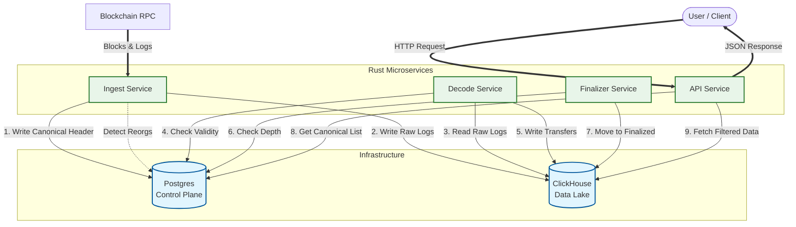

# Reorg-Safe Onchain Data Platform

> Production-grade blockchain indexer with proper chain reorganization handling

English | [Русский](README.ru.md)

---

## What is this?

A blockchain data indexing system that **actually handles reorgs correctly**. 

Most indexers either ignore reorganizations or handle them poorly. This one tracks canonical chain state, detects forks, finds common ancestors, and ensures your data stays consistent even when the chain reorganizes.

Built for Ethereum, designed to extend to other chains.

### Key Features

- **Reorg-safe architecture** — Detects reorganizations, finds LCA, marks orphaned blocks
- **Two-layer data model** — Separate `head` (real-time) and `finalized` (confirmed) data
- **Idempotent processing** — Safe to restart, re-index, or recover from crashes
- **Full observability** — Prometheus metrics, Grafana dashboards, structured logging
- **Production patterns** — Graceful shutdown, health checks, backpressure handling

---

## Why I built this

I kept seeing blockchain indexers that break silently when reorgs happen. Data becomes inconsistent, balances don't match, events get duplicated or lost.

This project demonstrates how to build indexing infrastructure that handles the messy reality of blockchain consensus — where the "latest block" might not be the latest block in 30 seconds.

---

## Architecture

